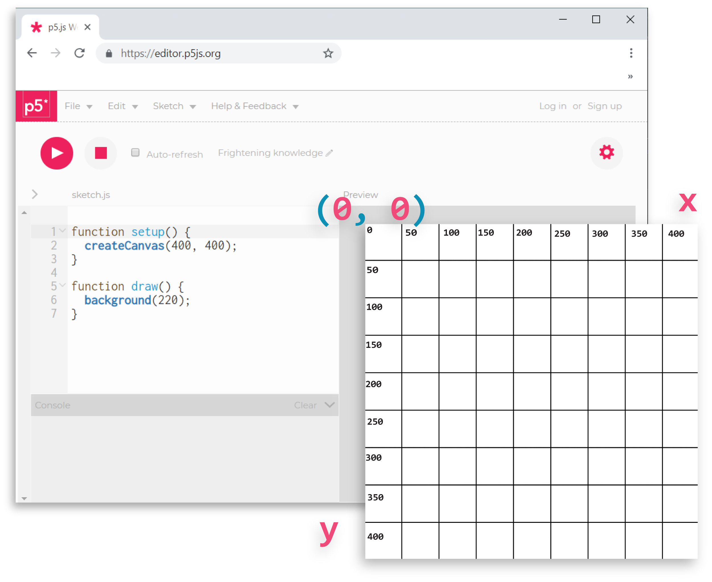

---

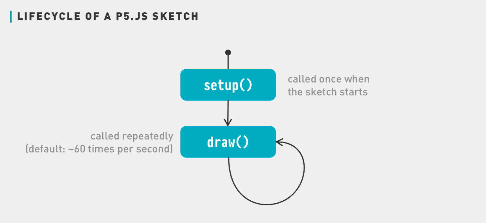

---

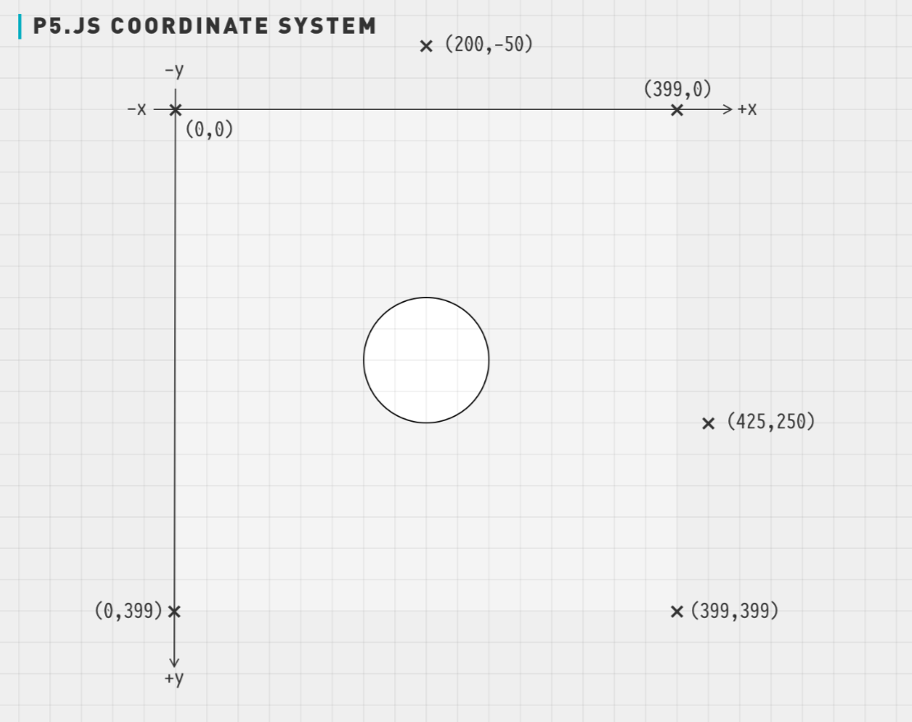

---

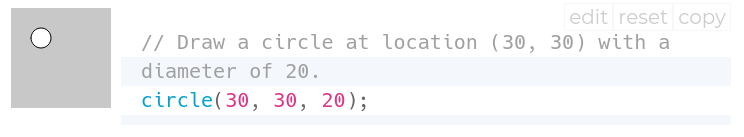

[Fai alcune prove con la guida in linea](https://p5js.org/reference/#/p5/circle)

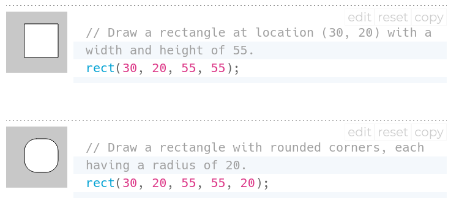

[Fai alcune prove con la guida in linea](https://p5js.org/reference/#/p5/rect)

---

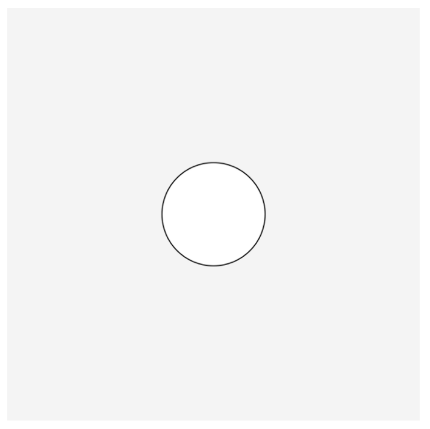

---

---

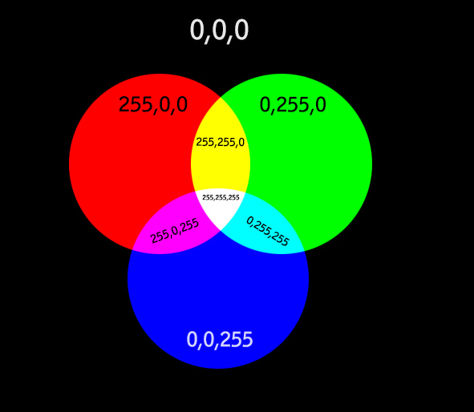

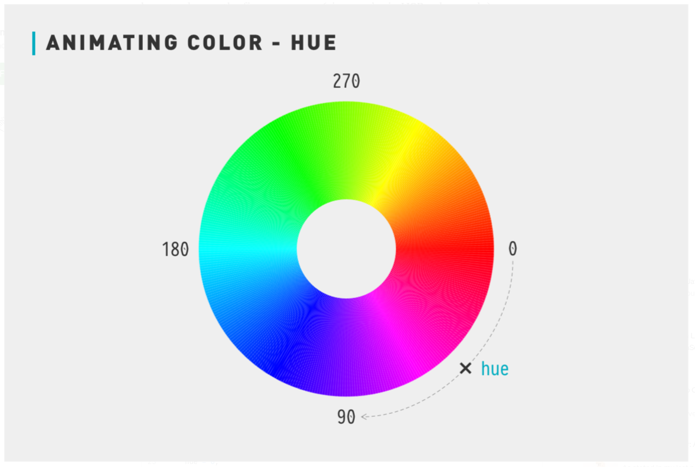

[Utilizza il Color Picker per scegliere un colore](https://colorpicker.me)

---

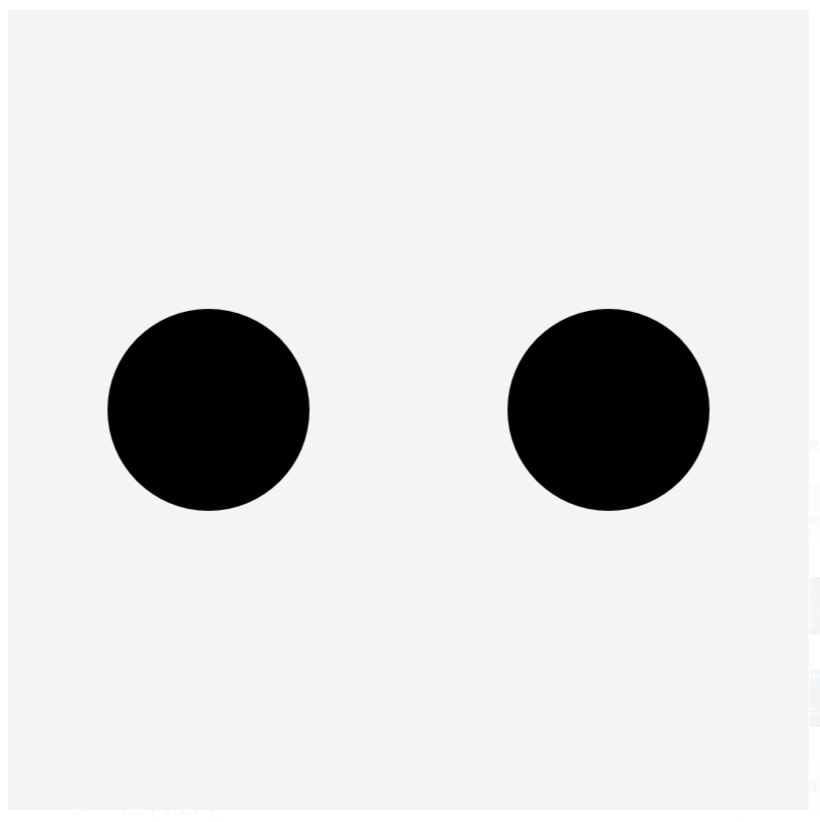

---

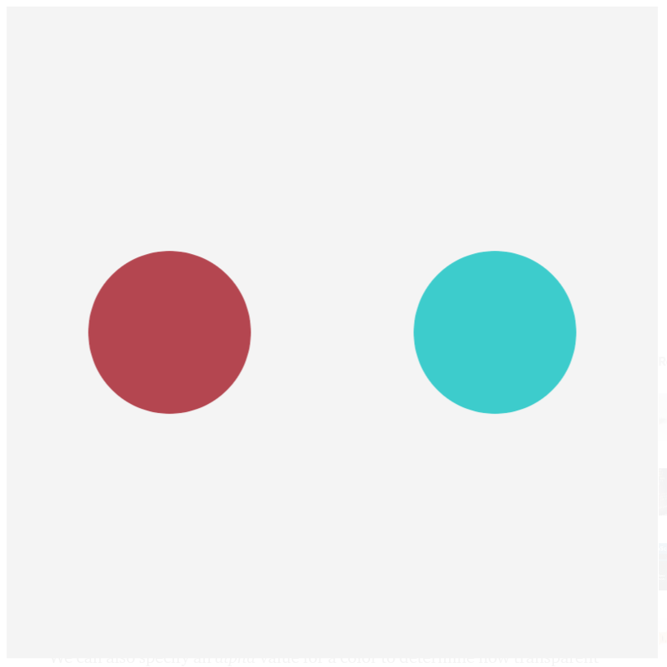

---

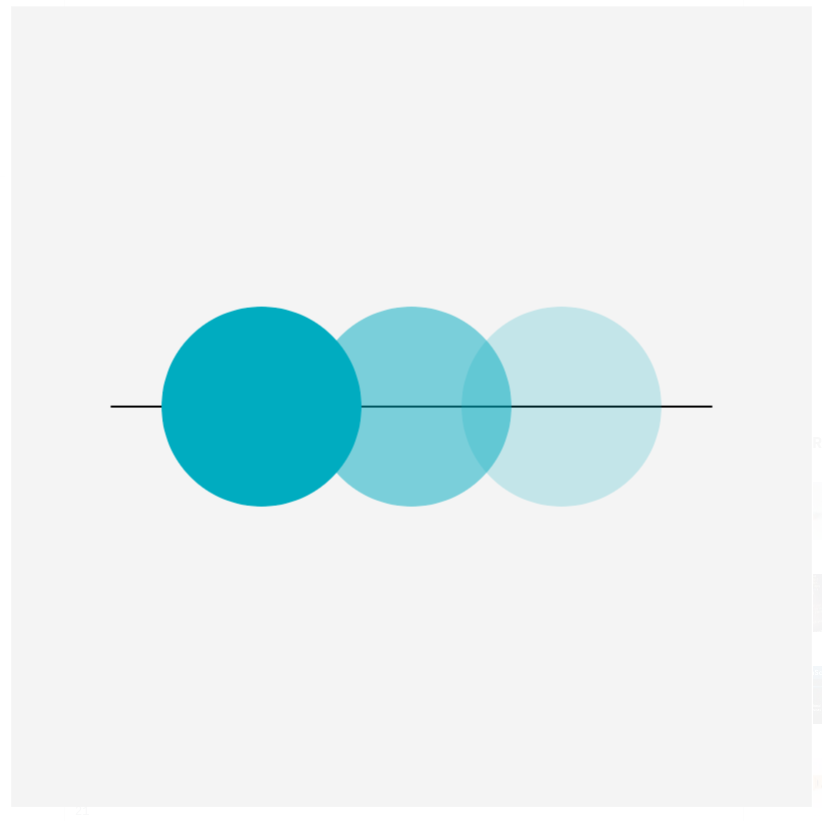

---

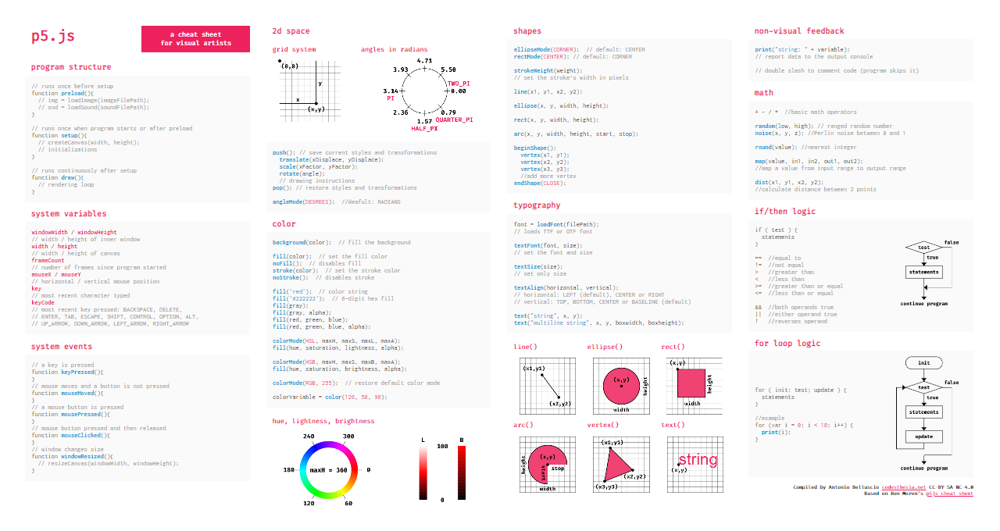

---

